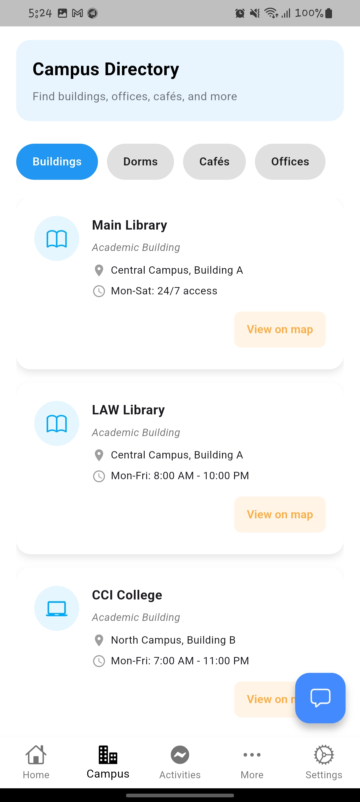
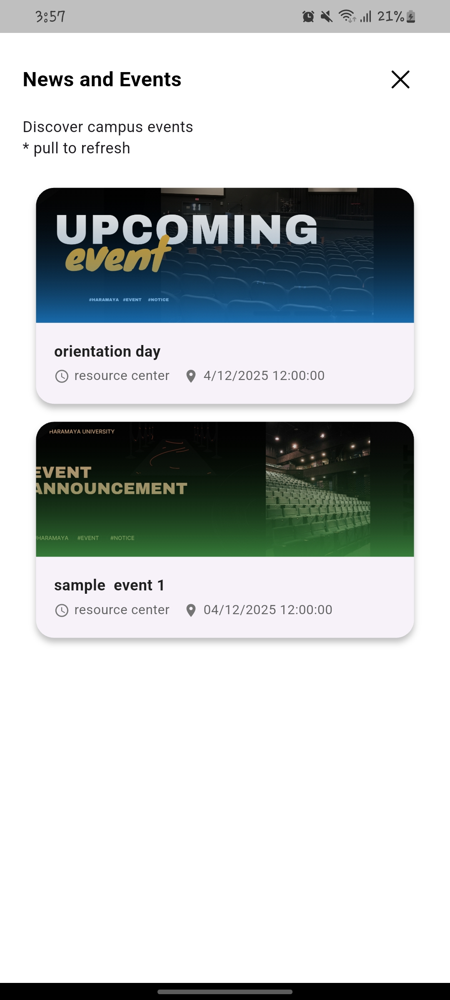
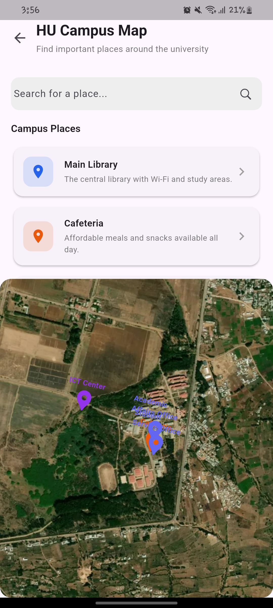
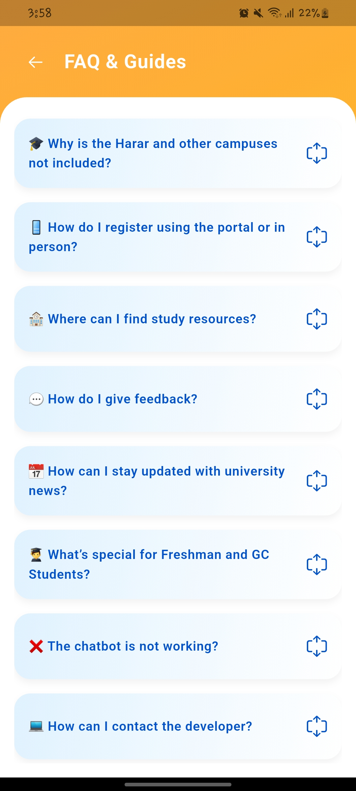

# HU Guide 📚🎓

**HU Guide** is a mobile application designed to help students, especially freshers at **Haramaya University**, navigate campus life, find academic information, and stay updated on events.  

---

## 🚀 Features

- 🏫 **Campus Information**: Explore colleges, departments, and programs.  
- 📅 **Events & Activities**: Stay updated with campus events and student activities.  
- 🗺️ **Campus Map**: Find your way around the campus easily.  
- 💬 **ChatBot**: Ask questions and get instant answers about the university.  
- ⚙️ **Settings**: Toggle dark/light mode and manage your account.  
- 🔒 **Secure Login & Registration**: Access personalized content safely.  

---

## 🎥 Demo Video

[](assets/hu_guide.mp4)

---

## Screenshots

|  |  |  |  |
|-------------------------------------------|-------------------------------------------|-------------------------------------------|-------------------------------------------|
|  |  |  |  |


---

## 🛠 Tech Stack

- **Flutter**: Cross-platform app development  
- **Dart**: Programming language  
- **Notifications**: Used Google sheet for events, lost and found and related features
- **Figma**: UI/UX design  

---

## ⚡ Installation

1. Clone the repository:

```bash
git clone https://github.com/Miftah-Fentaw/hu_guide_flutter.git
cd hu-guide
flutter pub get
flutter run
# hu_guide_flutter
